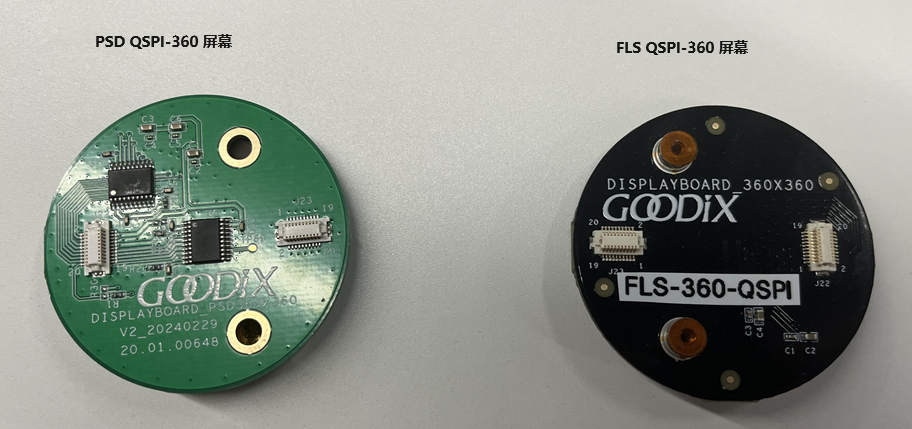

# graphics_lvgl_831_std_demo 工程使用说明

[TOC]

## 1. 工程简要说明

-   本工程是基于 Lvgl 831 开发的一个智能手表类参考demo. 使用时候先编译lvgl_optimize_lib 工程, 再编译本工程
-   lvgl_optimize_lib 库工程 优化了原生lvgl, 优化选项 位于工程的lv_conf.h. 可以根据需要修改


## 2. 工程编译配置

-   本工程同时支持两种SK开发板运行: GR5525 SK 和 GR5625 SK, 且每款SK 都支持两款屏幕 : FLS 360p 和PSD 360p
-   根据使用的芯片封装差异, 工程支持图片资源放置在内部 XQSPI Flash 和外部数据Flash, 用户可以根据实际情况进行配置
-   在进行工程编译前, 用户需要根据获取的SK 和屏幕型号, 进行工程编译的正确配置  


### 2.1 配置 SK 类型

在工程配置头文件 graphics_lvgl_831_std_demo\Src\config\custom_config.h 中, 配置宏 GR5625_SK

```c
// <o> SK version
// <0=> Config as GR5525_SK
// <1=> Config as GR5625_SK
#define GR5625_SK               1
// </h>
```

-   如果SK是 GR5625 SK, 将 GR5625_SK 配置为1
-   如果SK是 GR5525 SK, 将 GR5625_SK 配置为0


### 2.2 配置屏幕类型

在工程配置头文件graphics_lvgl_831_std_demo\Src\dev_drivers\display_crtl_drv.h 中, 配置宏 SCREEN_TYPE

```c
#define SCREEN_TYPE             1       // 1 - FLS-QSPI-360
                                        // 2 - PSD-QSPI-360
```

-   当SK带的屏幕型号是 FLS 360p, 配置 SCREEN_TYPE 为1
-   当SK带的屏幕型号是PSD 360p, 配置 SCREEN_TYPE 为2
-   屏幕的区别如下




### 2.3 配置资源烧写位置

一般情况下, 

-   GR5525 SK 板载SoC的XQSPI Flash为 1M Bytes, 存放代码后, 已无空间存储外部图片资源, 因此需要将 图片资源放置在外部Flash
-   GR5625 SK 板载SoC的XQSPI Flash为外扩的8M Bytes, 有较大的空间同时存储代码和示例工程的图片资源, 因此将图片资源存放在XQSPI Flash 的高地址空间

在示例工程的资源配置文件graphics_lvgl_831_std_demo\Src\app_image\lv_img_dsc_list.c中, 进行资源地址的配置: 

```
    #if GR5625_SK
        #define BINARY_RESOURCES (const uint8_t *) (0x00800000)       // If using Iond package, try to put resource into upper part of x-flash
    #else
        #define BINARY_RESOURCES (const uint8_t *) (QSPI0_XIP_BASE)     // If using external flash, change to responding XIP Address
    #endif
```

-   当使用GR5625 SK时, 图片资源放置在内部XQSPI 的地址空间,  默认设置为 0x00800000, 用户可以根据情况进行修改
-   当使用GR5525 SK时, 图片资源放置在外部 QSPI0所连接的Flash地址空间

**注:**

```
在使用GR5x25 设计智能手表类穿戴产品时,请选用 ion* 版本封装, 尽可能将图片资源放置在XQSPI Flash空间, 因为此Flash 空间运行主频更高,同时有缓存机制, 可以帮助产品获得更好的帧率 
```


### 2.4 烧写数据资源

根据 2.3 小结的 Flash 配置, 使用 GProgrammer工具将示例工程的图片资源烧写到对应的Flash空间， 图片资源文件位于 graphics_lvgl_831_std_demo\Src\app_image\binary_resources.bin

-   如果配置的地址位于 XQSPI Flash空间 (8MBytes 对应[0x00200000, 0x00A00000], 16MBytes对应[0x00200000, 0x01200000]) 将资源烧写到 内部Flash设备
-   如果配置的地址位于外部Flash 空间, 将图片资源文件烧写到对应的外部Flash即可 (注意偏移的计算)


## 3. 默认配置

工程的默认配置如下：

```c
#define SCREEN_TYPE             2       // 1 - FLS-QSPI-360
                                        // 2 - PSD-QSPI-360
```

```c
// <o> SK version
// <0=> Config as GR5525_SK
// <1=> Config as GR5625_SK
#define GR5625_SK               0
// </h>
```

```c
 #define BINARY_RESOURCES (const uint8_t *) (QSPI0_XIP_BASE)
```


**即：**

- 默认配置 支持搭载 PSD QSPI-360 屏幕的 GR5525 SK板, 且图片资源放置到外部QSPI0 所连接的Nor Flash, 偏移地址为 0x00000000
- 如果实际环境和默认配置有差异, 请根据上述参考进行修改

